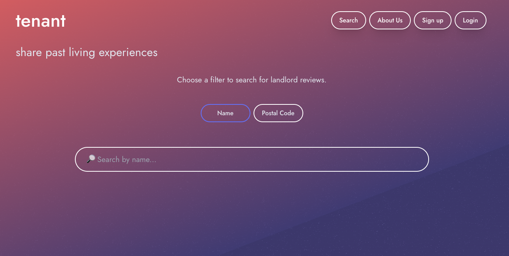
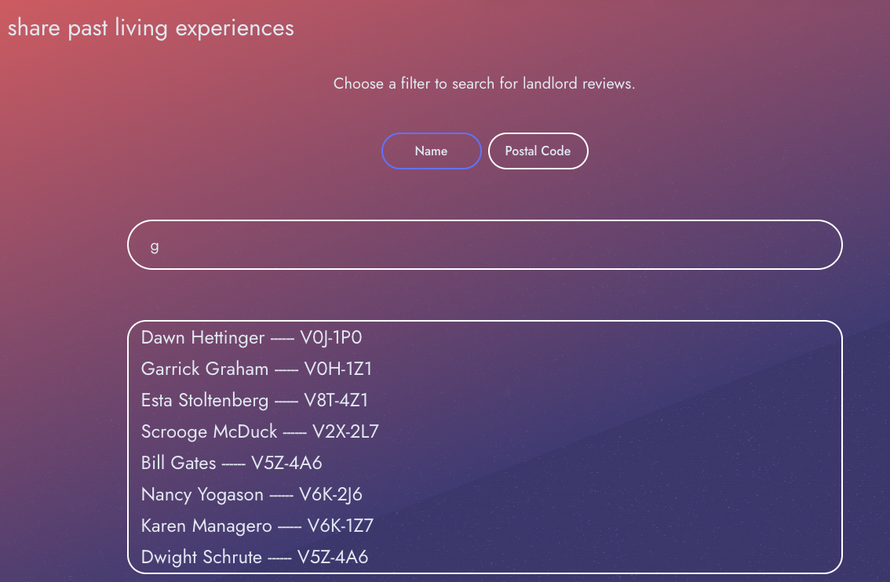
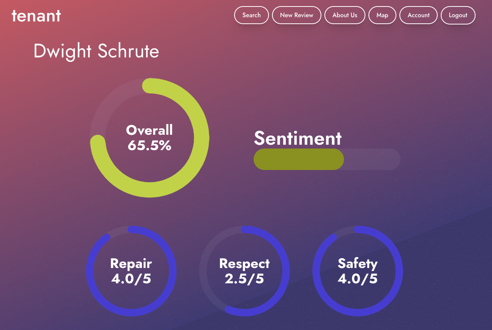
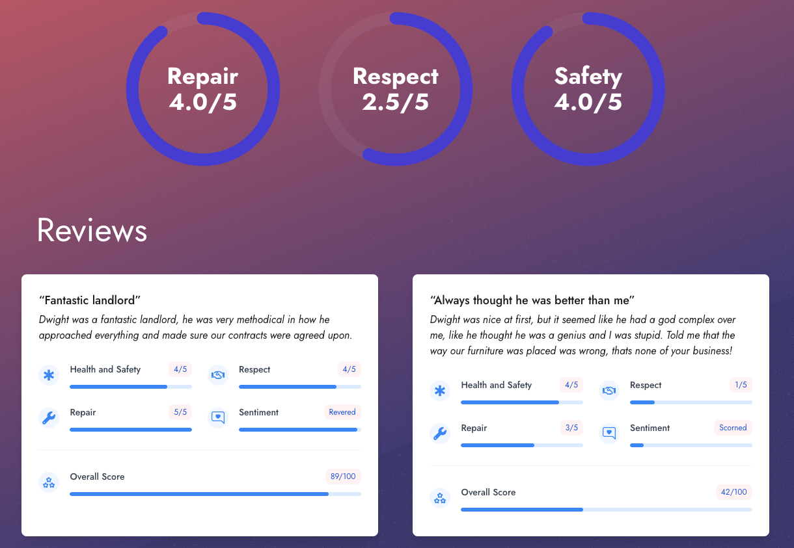
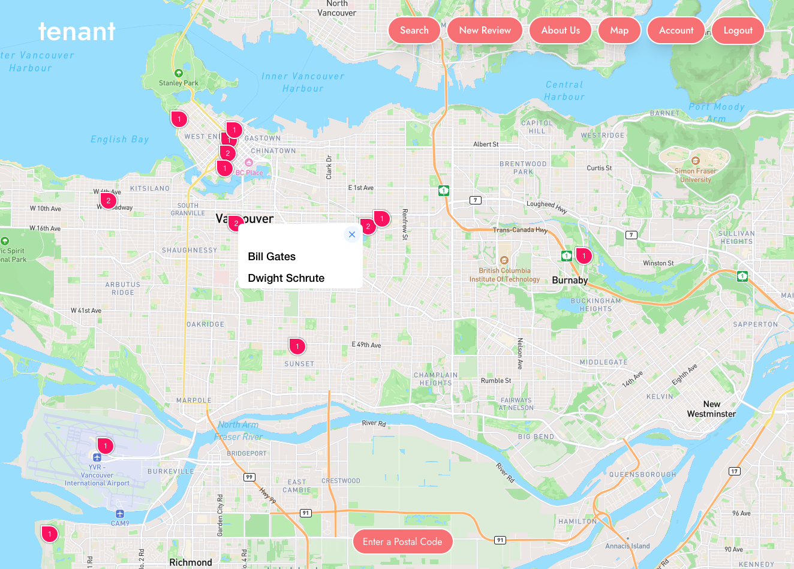
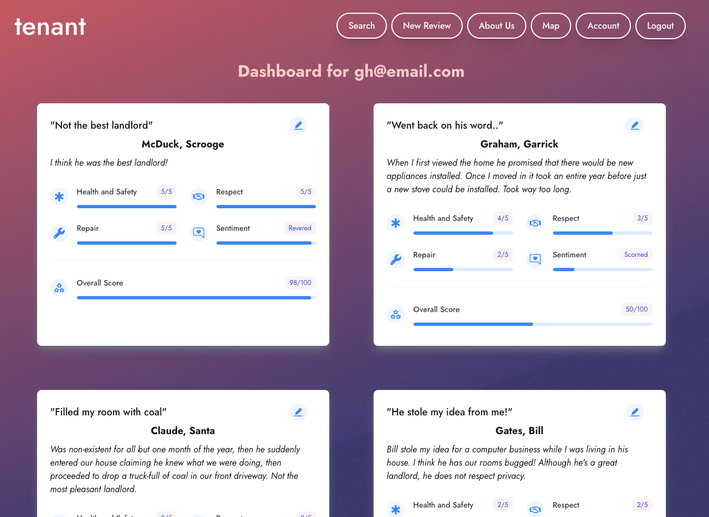

# Tenant

An application that seeks to increase the equity of information between tenants and landlords. Create and view previous tenants reviews of landlords, rate their behaviors in categories like health & safety, respect, and repairability. Each review is analyzed by Google Natural Language sentiment and view areas that have reviews on maps!

## Tech Stack

- Front-end:
  - React
  - JavaScript
  - Framer-Motion
  - Tailwind

- Back-end:
  - Node
  - Express
  - Mapbox API
  - Google Natural Language API
  - Mongoose
  - MongoDB

## Screenshots

The home page allows you to search by name or postal code for reviews

View the overall analytics for a landlord as well as their reviews

The map view allows you view properties with reviews in an area

View your created reviews and the sentiment attached to each review

## Installation
- Navigate to backend directory and `npm install`, do the same to the front-end directory.
- If you havn't already install TypeScript with `npm install -g typescript`
  - To check if its not installed try `tsc -v`
- In backend, create and follow the `.env.example` in a your `.env` file. Do the same in the front-end

